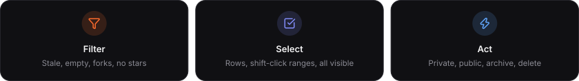
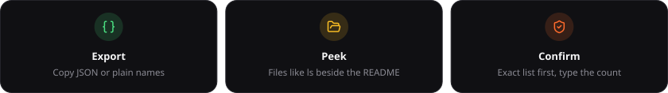

<p align="center">
<picture><source media="(prefers-color-scheme: light)" srcset="docs/gfx/banner-light.svg"></picture>
<picture><source media="(prefers-color-scheme: light)" srcset="docs/gfx/tiles-light.svg"></picture>
</p>

Select the repositories you no longer want public, make them private, archive them, or delete them, and copy the list as JSON for use elsewhere. Click any repository to see its files beside its README before you decide. Your token goes to `api.github.com` and nowhere else.

<p align="center">
<picture><source media="(prefers-color-scheme: light)" srcset="docs/gfx/strip-what-it-does-light.svg"></picture>
<picture><source media="(prefers-color-scheme: light)" srcset="docs/gfx-c/features-1-light.svg"></picture>
<picture><source media="(prefers-color-scheme: light)" srcset="docs/gfx-c/features-2-light.svg"></picture>
</p>

<p align="center">

</p>

Filters combine. Each chip cycles through *only*, *hide* and off, so "public, no forks, no stars" is three clicks; "all" clears them. Sort by push date, stars, age, size or name; search names and descriptions. The **select by** menu in the bar adds or removes a whole category from the selection (all forks, all private, everything stale, all visible), so you can show everything and still pick out the forks in one move.

<p align="center">

</p>

<p align="center">
<picture><source media="(prefers-color-scheme: light)" srcset="docs/gfx/strip-how-it-goes-light.svg"></picture>
<picture><source media="(prefers-color-scheme: light)" srcset="docs/gfx-c/timeline-light.svg"></picture>
</p>

Actions run one at a time with a short gap, so GitHub's secondary rate limit is not tripped. Every result is logged, and a failure on one repository does not stop the rest.

<p align="center">
<picture><source media="(prefers-color-scheme: light)" srcset="docs/gfx/strip-cannot-undo-light.svg"></picture>
<picture><source media="(prefers-color-scheme: light)" srcset="docs/gfx-c/scope-light.svg"></picture>
<picture><source media="(prefers-color-scheme: light)" srcset="docs/gfx-c/callout-private-light.svg"></picture>
<picture><source media="(prefers-color-scheme: light)" srcset="docs/gfx-c/callout-delete-light.svg"></picture>
</p>

Archived repositories are read-only; unarchive before changing their visibility. Every action lists the exact repositories it will touch before anything runs.

## Run it

Open `index.html` in a browser. That is the whole install.

To host it, fork the repository and set Settings, Pages, Source to "GitHub Actions". The included workflow (`.github/workflows/pages.yml`) publishes `index.html` alone on every push to `main`; nothing else in the repository reaches the site.

## Token and security

<p align="center">
<picture><source media="(prefers-color-scheme: light)" srcset="docs/gfx/strip-token-light.svg"></picture>
<picture><source media="(prefers-color-scheme: light)" srcset="docs/gfx-c/callout-token-light.svg"></picture>
<picture><source media="(prefers-color-scheme: light)" srcset="docs/gfx-c/pills-token-light.svg"></picture>
</p>

| Kind | What it needs |
| --- | --- |
| Fine-grained token (preferred) | all repositories, permission Administration: read and write; set an expiry |
| Classic token | scopes `repo` and `delete_repo`, nothing else |
| gh CLI | `gh auth refresh -h github.com -s repo,delete_repo`, then `gh auth token` prints one |

Without `delete_repo` everything except Delete works, and the page says so instead of failing.

**Where the token goes.** Into memory and, by default, `sessionStorage`, which the browser drops when the tab closes. Tick "remember on this browser" and it goes to `localStorage` instead, on that browser profile only. "Forget token" clears both. It is sent as an `Authorization` header to `https://api.github.com`, over HTTPS, and to no other host.

**What the page does not do.** It loads no script, stylesheet, font or image from any third party: the font is embedded, so the only network traffic is the GitHub API (and GitHub's own avatar and README images). There is no analytics, no server of ours, no build step that could inject anything; the file you open is the file you can read. The token form never submits natively, so the token never lands in a URL or in browser history.

**Third-party content.** A repository's README is HTML that GitHub rendered; it is shown inside an `<iframe sandbox>` with no scripts and no access to this page, so a malicious README cannot read the token. Repository names and descriptions are inserted as text, never as HTML.

**Good habits.** Mint a token for this job and give it an expiry. Add `delete_repo` only when you intend to delete, and revoke the token when the sweep is done (GitHub: Settings, Developer settings, Personal access tokens). Do not tick "remember" on a shared machine. If you host the page, host it from your own fork, so the code you run is code you can read.

## Graphics

The graphics above are SVG files with the font embedded, so GitHub renders them as designed in both themes; `<picture>` picks the light variant.

MIT.

## Spec (for AI agents)

```json
{
  "name": "repo-sweep",
  "form": "single HTML file, no build, no server, no dependencies, no third-party requests (font embedded)",
  "hosting": "GitHub Pages via .github/workflows/pages.yml, which publishes index.html only",
  "auth": {
    "token_storage": ["memory", "sessionStorage (default)", "localStorage (opt-in 'remember')"],
    "preferred_token": "fine-grained, all repositories, Administration: read and write, with an expiry",
    "classic_scopes": ["repo", "delete_repo"],
    "requests_go_to": "https://api.github.com only, Authorization header over HTTPS",
    "form": "onsubmit returns false; the token never enters a URL"
  },
  "data": "GET /user/repos?per_page=100&affiliation=owner, paginated by the Link header (public and private)",
  "filters": ["public", "private", "forks", "archived", "stale (no push in 365 days)", "empty (size 0)", "no stars (excluding forks)"],
  "filter_modes": "each chip cycles off -> only -> hide -> off; active chips combine with AND; 'all' clears them",
  "sorts": ["recently pushed", "least recently pushed", "most stars", "newest", "largest", "name"],
  "selection": ["checkbox", "row click", "shift-click range", "select all visible", "select-by menu: add or remove a category (all visible, public, private, forks, archived, stale, empty, no stars) or clear"],
  "actions": {
    "private": "PATCH /repos/:full_name {private:true}",
    "public": "PATCH /repos/:full_name {private:false}",
    "archive": "PATCH /repos/:full_name {archived:true}",
    "unarchive": "PATCH /repos/:full_name {archived:false}",
    "delete": "DELETE /repos/:full_name, requires typing the count"
  },
  "run_policy": "sequential, 300 ms gap, per-repo log, stop on 401 or rate limit",
  "peek": {
    "files": "GET /repos/:full_name/contents/:path, directories first, navigable",
    "readme": "GET /repos/:full_name/readme with Accept: application/vnd.github.html, shown in an iframe sandbox (no scripts, no same-origin) with <base> at the raw default branch",
    "layout": "files 5 : readme 3, stacked under 860px"
  },
  "export": {
    "json_fields": ["name", "full_name", "description", "language", "stars", "forks", "private", "fork", "archived", "url", "homepage", "pushed_at", "created_at", "size_kb"],
    "names": "plain array of repository names",
    "scope": "the selection, or everything visible when nothing is selected"
  },
  "security": ["no third-party scripts, styles, fonts or analytics", "API text rendered via textContent, never innerHTML", "third-party README HTML confined to a sandboxed iframe", "token never in a URL", "recommend an expiring fine-grained token, delete_repo only when deleting, revoke after the sweep"],
  "irreversible": ["public to private erases stars and watchers and detaches forks", "delete keeps no copy", "archived is read-only until unarchived"],
  "license": "MIT"
}
```

**Rules:** keep it one file with zero dependencies and zero third-party requests; every destructive action lists the exact repositories first; no `alert`/`confirm`/`prompt`; nothing account-specific in the code; no literal closing body tag anywhere in the script, not even in a comment.
