<p align="center">
<picture><source media="(prefers-color-scheme: light)" srcset="docs/gfx/banner-light.svg">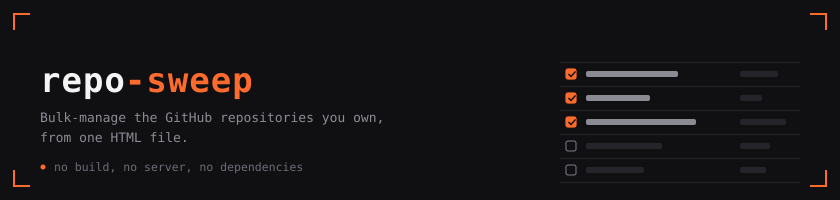</picture>
<picture><source media="(prefers-color-scheme: light)" srcset="docs/gfx/tiles-light.svg">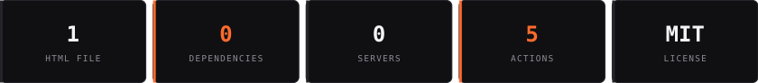</picture>
</p>

Select the repositories you no longer want public, make them private, archive them, or delete them, and copy the list as JSON for use elsewhere. Click any repository to see its files beside its README before you decide. Your token goes to `api.github.com` and nowhere else.

**Use it now: [siddhu123m.github.io/repo-sweep](https://siddhu123m.github.io/repo-sweep/)**, or open `index.html` from a clone. Same file either way.

<p align="center">
<picture><source media="(prefers-color-scheme: light)" srcset="docs/gfx/strip-what-it-does-light.svg"></picture>
<picture><source media="(prefers-color-scheme: light)" srcset="docs/gfx/card-filter-light.svg">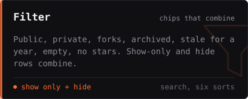</picture>
<picture><source media="(prefers-color-scheme: light)" srcset="docs/gfx/card-select-light.svg">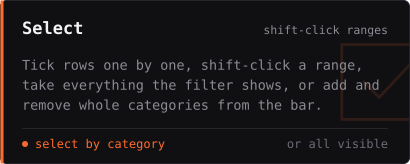</picture>
<picture><source media="(prefers-color-scheme: light)" srcset="docs/gfx/card-act-light.svg">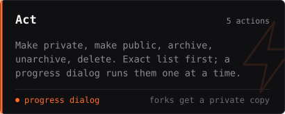</picture>
<picture><source media="(prefers-color-scheme: light)" srcset="docs/gfx/card-export-light.svg">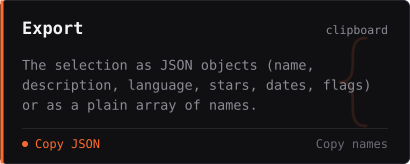</picture>
<picture><source media="(prefers-color-scheme: light)" srcset="docs/gfx/card-peek-light.svg">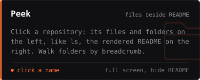</picture>
<picture><source media="(prefers-color-scheme: light)" srcset="docs/gfx/card-confirm-light.svg">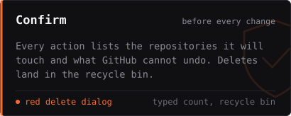</picture>
</p>

<p align="center">
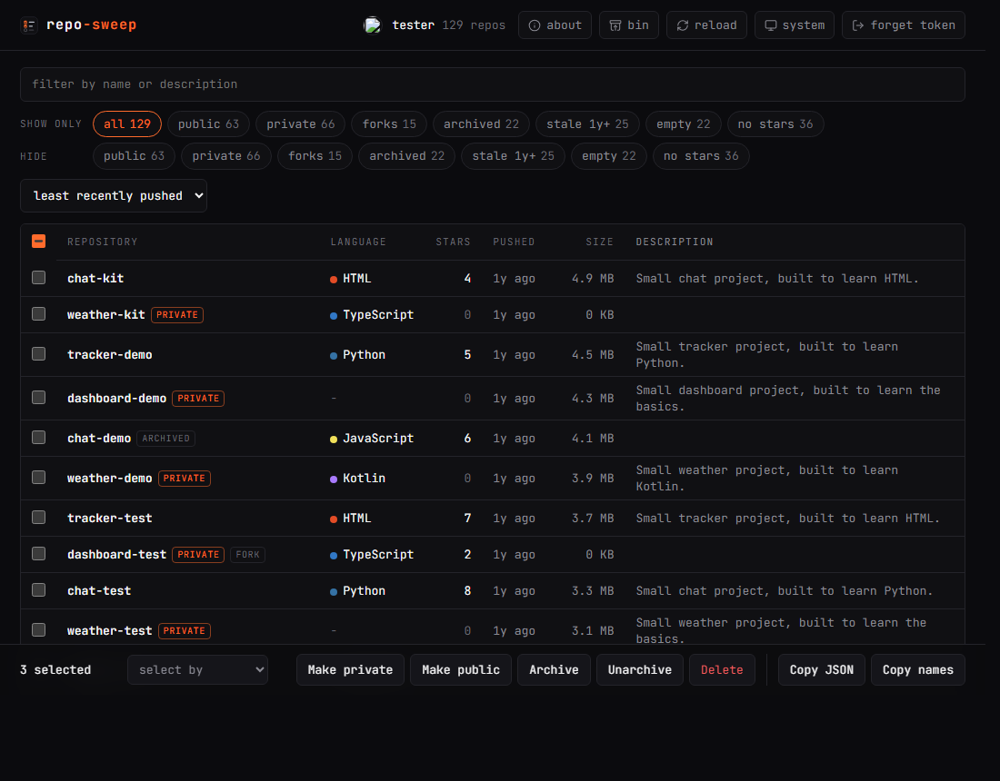
</p>

Two rows of chips over the same categories: **show only** and **hide**. They combine, so "public" in the first row plus "forks" and "no stars" in the second shows public repositories that are neither forks nor unstarred; "all" clears both rows. Sort by push date, stars, age, size or name; search names and descriptions. The **select by** menu in the bar adds or removes a whole category from the selection (all forks, all private, everything stale, all visible), so you can show everything and still pick out the forks in one move.

<p align="center">
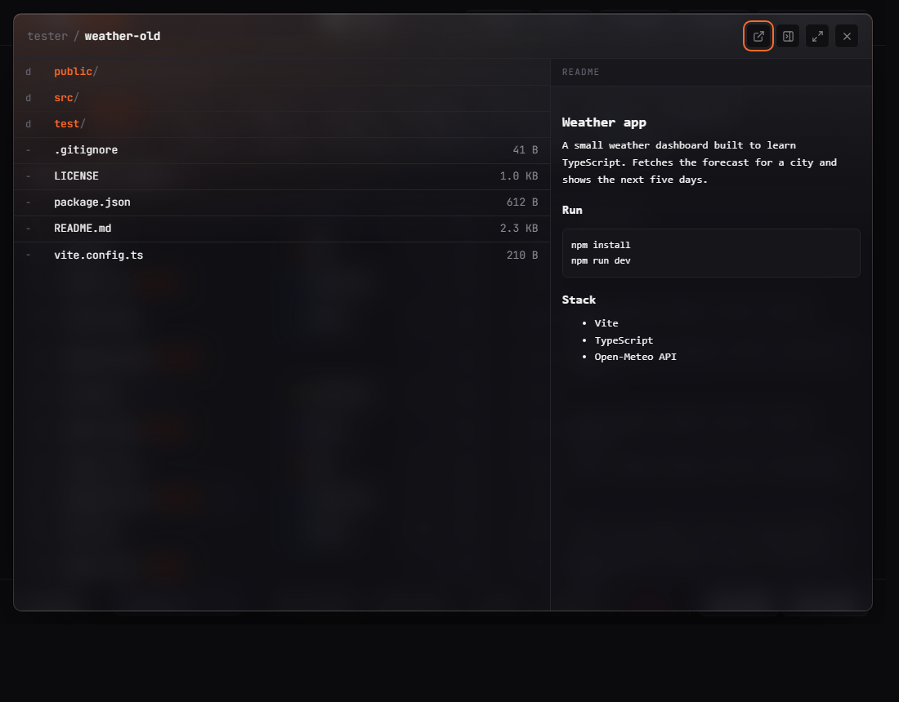
</p>

<p align="center">
<picture><source media="(prefers-color-scheme: light)" srcset="docs/gfx/strip-how-it-goes-light.svg"></picture>
<picture><source media="(prefers-color-scheme: light)" srcset="docs/gfx-c/timeline-light.svg">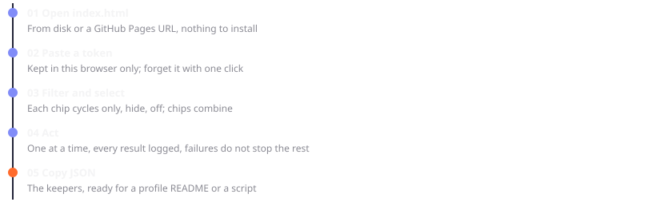</picture>
</p>

Actions run one at a time with a short gap, so GitHub's secondary rate limit is not tripped. A progress dialog shows the bar, the count, the repository being worked on and a live log; it stays until the run ends. A failure on one repository does not stop the rest.

<p align="center">
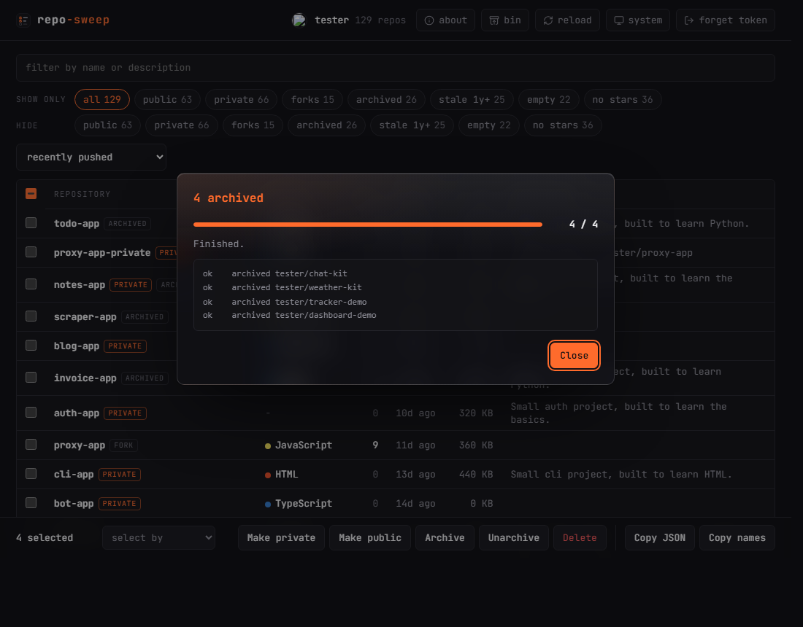
</p>

<p align="center">
<picture><source media="(prefers-color-scheme: light)" srcset="docs/gfx/strip-cannot-undo-light.svg"></picture>
<picture><source media="(prefers-color-scheme: light)" srcset="docs/gfx-c/scope-light.svg"></picture>
<picture><source media="(prefers-color-scheme: light)" srcset="docs/gfx-c/callout-private-light.svg"></picture>
<picture><source media="(prefers-color-scheme: light)" srcset="docs/gfx-c/callout-delete-light.svg">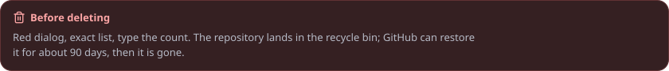</picture>
<picture><source media="(prefers-color-scheme: light)" srcset="docs/gfx-c/callout-bin-light.svg">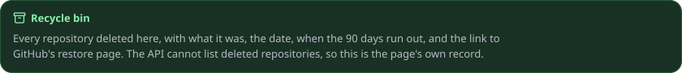</picture>
</p>

Archived repositories are read-only; unarchive before changing their visibility. Every action lists the exact repositories it will touch before anything runs. In the peek dialog, "hide readme" gives the file list the whole width and "full screen" fills the window; both animate, and the dialogs fade and settle rather than pop.

**Deleting, with a net.** The delete dialog is red, lists every repository, and asks you to type the count. GitHub keeps a deleted repository restorable for about 90 days under Settings, Repositories, Deleted repositories (not always for forks). Its API cannot list or restore them, so the page keeps its own **recycle bin** (the `bin` button in the header): every repository deleted here, with what it was, the date, the day the 90 days run out, and the restore steps: open github.com/settings/deleted_repositories as the owner, find the name, click Restore, wait up to an hour; code, branches, issues, pull requests, wiki and settings come back, release attachments, team permissions and issue labels do not, and a fork whose network still exists cannot be restored. The list lives in this browser and can be copied as JSON.

**Forks cannot be made private.** GitHub refuses the change on any fork (the API answers 422); the only route is a separate repository. When "make private" meets forks, the dialog says so and offers to create an empty private repository for each one, named after the fork plus a suffix (`-private` by default). It then gives you the two git commands that move the whole history into the copy, ready to paste. The fork itself stays as it is until you delete it, which you can do from the same page once the copy is pushed. A fork you never changed is only a bookmark: deleting it and starring the original costs nothing.

## Run it

Open [the hosted page](https://siddhu123m.github.io/repo-sweep/) or `index.html` in a browser. That is the whole install. The first visit opens an About dialog with the features, the security notes and who built it; the `about` button in the header brings it back.

To host it, fork the repository and set Settings, Pages, Source to "GitHub Actions". The included workflow (`.github/workflows/pages.yml`) publishes `index.html` alone on every push to `main`; nothing else in the repository reaches the site.

## Token and security

<p align="center">
<picture><source media="(prefers-color-scheme: light)" srcset="docs/gfx/strip-token-light.svg"></picture>
<picture><source media="(prefers-color-scheme: light)" srcset="docs/gfx-c/callout-token-light.svg">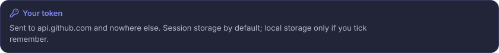</picture>
<picture><source media="(prefers-color-scheme: light)" srcset="docs/gfx-c/pills-token-light.svg"></picture>
</p>

| Kind | What it needs |
| --- | --- |
| Fine-grained token (preferred) | all repositories, permission Administration: read and write; set an expiry |
| Classic token | scopes `repo` and `delete_repo`, nothing else |
| gh CLI | `gh auth refresh -h github.com -s repo,delete_repo`, then `gh auth token` prints one |

Without `delete_repo` everything except Delete works, and the page says so instead of failing.

**Where the token goes.** Into memory and, by default, `sessionStorage`, which the browser drops when the tab closes. Tick "remember on this browser" and it goes to `localStorage` instead, on that browser profile only. "Forget token" clears both. It is sent as an `Authorization` header to `https://api.github.com`, over HTTPS, and to no other host.

**What the page does not do.** It loads no script, stylesheet, font or image from any third party: the font is embedded, so the only network traffic is the GitHub API (and GitHub's own avatar and README images). There is no analytics, no server of ours, no build step that could inject anything; the file you open is the file you can read. The token form never submits natively, so the token never lands in a URL or in browser history.

**Third-party content.** A repository's README is HTML that GitHub rendered; it is shown inside an `<iframe sandbox>` with no scripts and no access to this page, so a malicious README cannot read the token. Repository names and descriptions are inserted as text, never as HTML.

**Good habits.** Mint a token for this job and give it an expiry. Add `delete_repo` only when you intend to delete, and revoke the token when the sweep is done (GitHub: Settings, Developer settings, Personal access tokens). Do not tick "remember" on a shared machine. If you host the page, host it from your own fork, so the code you run is code you can read.

## Built by

<p align="center">
<picture><source media="(prefers-color-scheme: light)" srcset="docs/gfx/strip-built-by-light.svg"></picture>
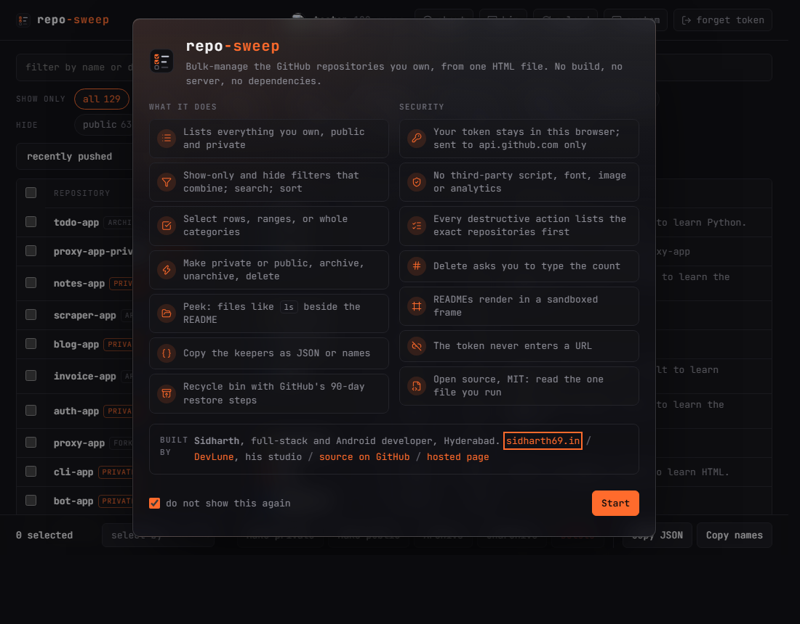
</p>

**Sidharth**, full-stack and Android developer in Hyderabad: [sidharth69.in](https://sidharth69.in). Made at [DevLune](https://devlune.in), his software studio. Source: [github.com/SIDDHU123M/repo-sweep](https://github.com/SIDDHU123M/repo-sweep). Hosted: [siddhu123m.github.io/repo-sweep](https://siddhu123m.github.io/repo-sweep/). MIT.

## Graphics

The graphics above are SVG files with the font embedded, so GitHub renders them as designed in both themes; `<picture>` picks the light variant.

MIT.

## Spec (for AI agents)

```json
{
  "name": "repo-sweep",
  "form": "single HTML file, no build, no server, no dependencies, no third-party requests (font embedded)",
  "hosting": "GitHub Pages via .github/workflows/pages.yml, which publishes index.html and og.png only; live at https://siddhu123m.github.io/repo-sweep/",
  "source": "https://github.com/SIDDHU123M/repo-sweep",
  "author": { "name": "Sidharth", "site": "https://sidharth69.in", "studio": "DevLune, https://devlune.in", "location": "Hyderabad, India" },
  "about_dialog": "opens on the first visit (localStorage 'repo-sweep:seen'), again from the header; features, security, credits",
  "auth": {
    "token_storage": ["memory", "sessionStorage (default)", "localStorage (opt-in 'remember')"],
    "preferred_token": "fine-grained, all repositories, Administration: read and write, with an expiry",
    "classic_scopes": ["repo", "delete_repo"],
    "requests_go_to": "https://api.github.com only, Authorization header over HTTPS",
    "form": "onsubmit returns false; the token never enters a URL"
  },
  "data": "GET /user/repos?per_page=100&affiliation=owner, paginated by the Link header (public and private)",
  "filters": ["public", "private", "forks", "archived", "stale (no push in 365 days)", "empty (size 0)", "no stars (excluding forks)"],
  "filter_modes": "two chip rows, show-only and hide, over the same categories; a category is in one row at a time; active chips combine with AND; 'all' clears both",
  "sorts": ["recently pushed", "least recently pushed", "most stars", "newest", "largest", "name"],
  "selection": ["checkbox", "row click", "shift-click range", "select all visible", "select-by menu: add or remove a category (all visible, public, private, forks, archived, stale, empty, no stars) or clear"],
  "actions": {
    "private": "PATCH /repos/:full_name {private:true}; forks are refused by GitHub, so the dialog offers POST /user/repos {name: fork+suffix, private:true} per fork plus the git clone --bare / push --mirror commands, and the fork is left in place",
    "public": "PATCH /repos/:full_name {private:false}",
    "archive": "PATCH /repos/:full_name {archived:true}",
    "unarchive": "PATCH /repos/:full_name {archived:false}",
    "delete": "DELETE /repos/:full_name, red dialog, requires typing the count; the deleted repository is recorded in the recycle bin (localStorage 'repo-sweep:bin', with restore_until = +90 days) which links to https://github.com/settings/deleted_repositories; the GitHub API cannot list or restore deleted repositories"
  },
  "run_policy": "sequential, 300 ms gap, a progress dialog (bar, counter, current repository, live log) that cannot be dismissed until the run ends, stop on 401 or rate limit",
  "peek": {
    "files": "GET /repos/:full_name/contents/:path, directories first, navigable",
    "readme": "GET /repos/:full_name/readme with Accept: application/vnd.github.html, shown in an iframe sandbox (no scripts, no same-origin) with <base> at the raw default branch",
    "layout": "files 5 : readme 3, stacked under 860px"
  },
  "export": {
    "json_fields": ["name", "full_name", "description", "language", "stars", "forks", "private", "fork", "archived", "url", "homepage", "pushed_at", "created_at", "size_kb"],
    "names": "plain array of repository names",
    "scope": "the selection, or everything visible when nothing is selected"
  },
  "security": ["no third-party scripts, styles, fonts or analytics", "API text rendered via textContent, never innerHTML", "third-party README HTML confined to a sandboxed iframe", "token never in a URL", "recommend an expiring fine-grained token, delete_repo only when deleting, revoke after the sweep"],
  "irreversible": ["public to private erases stars and watchers and detaches forks", "delete: GitHub can restore for about 90 days (Settings, Repositories, Deleted repositories), then gone; repo-sweep keeps a bin entry", "archived is read-only until unarchived"],
  "theme": "system, light or dark from the header button; stored in localStorage 'repo-sweep:theme' and applied before first paint",
  "peek_modes": ["hide readme (files take the full width)", "full screen", "animated open, close and resize; disabled under prefers-reduced-motion"],
  "license": "MIT"
}
```

**Rules:** keep it one file with zero dependencies and zero third-party requests; every destructive action lists the exact repositories first; no `alert`/`confirm`/`prompt`; nothing account-specific in the code; no literal closing body tag anywhere in the script, not even in a comment.
